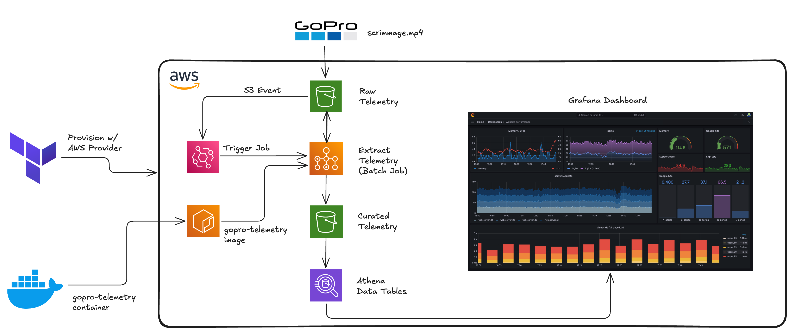

# GoPro Telemetry Analysis

## Project Overview

This project implements a serverless data pipeline to extract and visualize telemetry (GPMF) data from GoPro videos. Raw .MP4 files are uploaded to Amazon S3, where an S3 event triggers an AWS Batch job running a custom container (built with gopro-telemetry) to parse GPS, accelerometer, and gyroscope streams. The processed outputs are stored in a curated S3 bucket as Parquet/JSON files, which are then queried using Amazon Athena. Finally, the telemetry is visualized in Grafana dashboards, enabling rich time-series analysis of speed, movement, and positioning data. The architecture is provisioned with Terraform and designed to be low-cost, scalable, and easy to extend with additional analytics or visualization layers in the future.

## System Architecture

