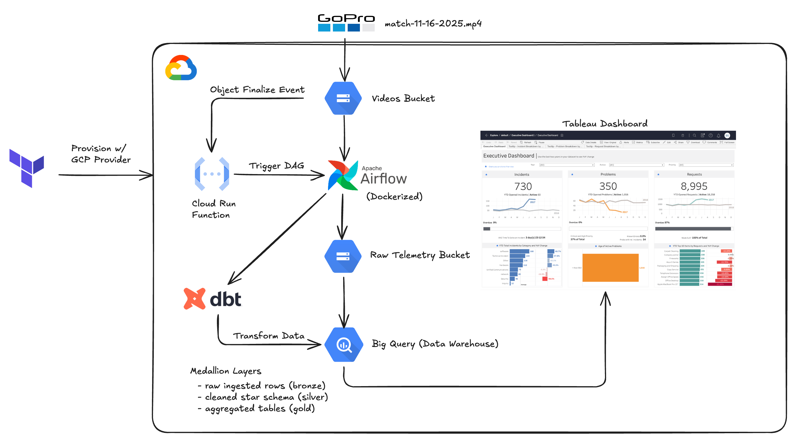

# GoPro Telemetry Analysis

## Project Overview

This project implements a fully serverless data pipeline on Google Cloud Platform (GCP) to extract and visualize GPMF telemetry from GoPro videos. When a raw .mp4 file is uploaded to a Google Cloud Storage (GCS) bucket, a Storage Object Finalize event publishes a message to Pub/Sub. A self-hosted Airflow instance (running in Docker) consumes this message to trigger a custom ETL workflow using a containerized GoPro parser stored in Artifact Registry. The workflow extracts embedded GPS, accelerometer, and gyroscope streams and writes the processed outputs to a curated GCS bucket. These curated datasets are then loaded into BigQuery for scalable analytics. Grafana connects directly to BigQuery to provide rich, time-series dashboards for insights into speed, movement, and overall performance. The entire system is provisioned with Terraform, creating a cost-efficient, event-driven, and easily extensible architecture for future analytics and visualization enhancements.

## System Architecture

## Technologies

- GoPro (GPMF) – Raw video + sensor telemetry
- GCS – Raw and curated data storage
- Pub/Sub – Notifications on new video uploads
- Airflow (Dockerized) – ETL orchestration
- Artifact Registry – ETL container storage
- Docker – Containerized ETL environment
- BigQuery – Telemetry analytics
- Grafana – BigQuery-powered dashboards
- Terraform – IaC for all GCP resources
