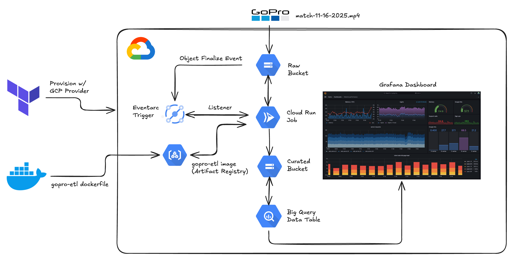

# GoPro Telemetry Analysis

## Project Overview

This project implements a serverless data pipeline on Google Cloud Platform (GCP) to extract and visualize telemetry (GPMF) data from GoPro videos. Raw .MP4 files are uploaded to Google Cloud Storage (GCS), where an Object Finalize event triggers a Cloud Composer (Airflow) DAG that launches a KubernetesPodOperator task running a custom container (built with gopro-telemetry) to parse GPS, accelerometer, and gyroscope streams. The processed outputs are stored in a curated GCS bucket as Parquet/JSON files, which are then loaded into BigQuery for querying and analysis. Finally, the telemetry is visualized in Grafana dashboards connected to BigQuery, enabling rich time-series analysis of speed, movement, and positioning data. The architecture is provisioned with Terraform and designed to be low-cost, scalable, and easily extensible with additional analytics or visualization layers in the future.

## System Architecture

## Technologies

- GoPro (GPMF Telemetry) – Source of raw video and embedded sensor data
- Google Cloud Storage (GCS) – Raw and curated data storage layers
- Pub/Sub – Event-driven messaging for object finalize notifications
- Cloud Composer (Airflow) – Orchestrates the data pipeline
- KubernetesPodOperator – Runs the telemetry extraction container
- Artifact Registry – Stores and serves the custom ETL Docker image
- BigQuery – Serverless analytics warehouse for processed telemetry
- Grafana (Managed on GCP) – Visualization layer for time-series insights
- Docker – Containerization for the ETL processing image
- Terraform – Infrastructure as Code for provisioning all resources
