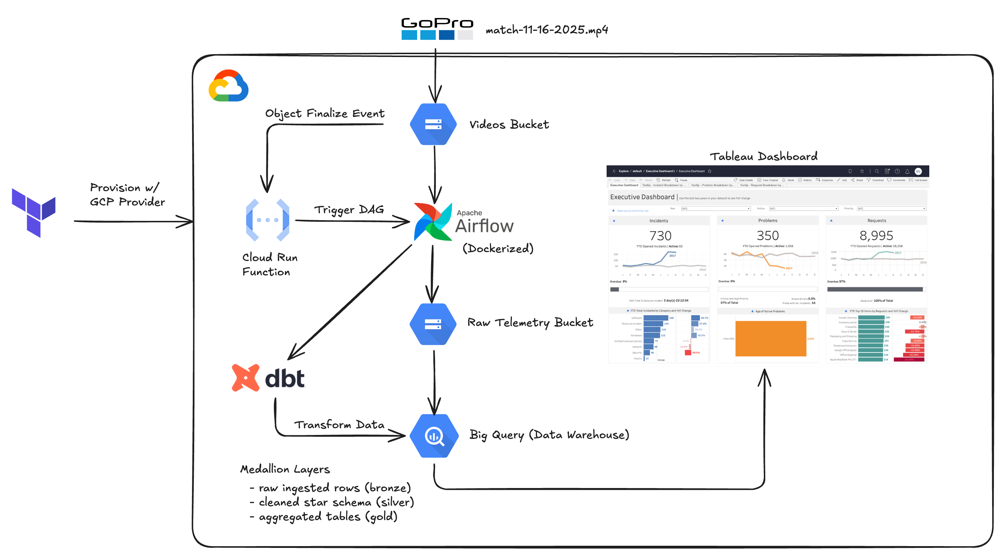
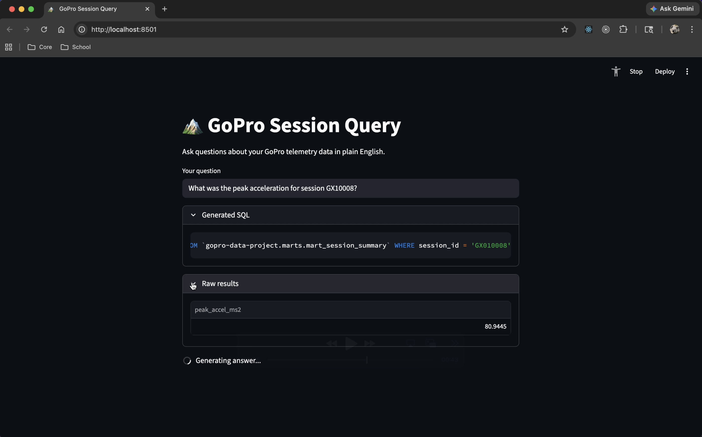

# GoPro Telemetry Pipeline

An end-to-end ELT data pipeline on Google Cloud Platform (GCP) that extracts telemetry from GoPro .mp4 files and surfaces insights via Tableau dashboards. When a raw .mp4 file is uploaded to GCS, it triggers an Airflow DAG that extracts embedded GPMF telemetry (GPS, accelerometer, gyroscope), loads the raw data into BigQuery, then runs dbt transformations to produce clean, aggregated tables for Tableau.

## System Architecture



## Pipeline Flow

```
GoPro .mp4 upload
  -> GCS Videos Bucket          (raw file landing zone)
  -> Cloud Run Function          (triggered by GCS Object Finalize event)
  -> Airflow DAG (Dockerized)    (orchestrates all downstream steps)
  -> py-gpmf-parser              (PythonOperator, extracts telemetry from .mp4)
  -> GCS Raw Telemetry Bucket    (extracted Parquet files, one per stream)
  -> BigQuery Load               (GCS -> BQ raw dataset)
  -> dbt (via Astronomer Cosmos) (transforms data through medallion layers)
  -> Tableau Public              (connects to Gold mart tables via CSV export)
```

## Technology Stack

| Component       | Tool                        | Notes                                      |
| --------------- | --------------------------- | ------------------------------------------ |
| Cloud Platform  | Google Cloud Platform (GCP) |                                            |
| File Storage    | Google Cloud Storage (GCS)  | Two buckets: videos and raw telemetry      |
| Triggering      | Cloud Run Function          | Calls Airflow REST API on GCS finalize     |
| Orchestration   | Apache Airflow (Dockerized) | Runs locally via Docker Compose            |
| GPMF Extraction | py-gpmf-parser              | PythonOperator, compiled into custom Airflow image |
| Data Warehouse  | Google BigQuery             | Hosts all three medallion layers           |
| Transformation  | dbt-bigquery + Cosmos       | Cosmos exposes dbt models as Airflow tasks |
| Visualization   | Tableau Public              | Fed via CSV export from BigQuery Gold      |
| IaC             | Terraform (GCP provider)    | Provisions all GCP resources               |

## Medallion Architecture

All three layers live in BigQuery as separate datasets.

### Bronze — `raw.*`

Raw ingested rows, no transformations. Immutable historical record.

- `raw.telemetry_samples`

### Silver — `intermediate.*`

Kimball dimensional model. Cleaned, typed, deduplicated.

- `intermediate.fact_telemetry_sample` — one row per sensor reading; grain is one sample per timestamp per session
- `intermediate.dim_session` — one row per GoPro recording (filename, start time, duration, activity type)
- `intermediate.dim_date` — pre-populated date spine with calendar attributes

### Gold — `mart.*`

Aggregated, BI-ready tables. Tableau reads from these.

- `mart.session_summary` — one row per session (max speed, total distance, elevation gain, duration)
- `mart.speed_over_time` — time-series speed per session
- `mart.gps_trace` — lat/lon per session for map visualizations

## Data Quality

dbt schema tests are declared at each layer:

- `not_null` and `unique` on primary keys
- `accepted_values` on categorical fields
- `relationships` between fact and dimension tables
- Airflow alerts on dbt test failures

## Repository Structure

```
gopro-data-project/
  airflow/          # DAG definitions, Docker Compose
  dbt/              # dbt project (models, schema tests, sources)
    models/
      bronze/
      silver/
      gold/
  terraform/        # all GCP infrastructure as code
  .github/          # CI workflows
```

## LLM Integration

A natural language query interface built on top of the BigQuery marts layer using the Claude API and Streamlit. Ask plain-English questions about your GoPro telemetry data — Claude converts the question into a BigQuery SQL query, executes it, then interprets the results back into a plain-English answer.



### How it works

```
User question
  -> Claude API (NL -> SQL, using mart schema as context)
  -> BigQuery marts (query execution)
  -> Claude API (results -> plain English answer)
  -> Streamlit UI (displays generated SQL, raw results, and answer)
```

### Code structure

```
streamlit/
  app.py              # Streamlit UI
  src/
    prompts.py        # System prompts for SQL generation and answer generation
    llm.py            # Claude API calls
    bigquery.py       # BigQuery query execution
  Dockerfile
  requirements.txt
```

### Example

> **Question:** What was the peak acceleration for session GX10008?
>
> **Generated SQL:** `SELECT peak_accel_ms2 FROM gopro-data-project.marts.mart_session_summary WHERE session_id = 'GX010008'`
>
> **Answer:** Your peak acceleration during session GX10008 was **80.94 m/s²**, which is roughly **8.25 G's** — more than double what you'd feel on a roller coaster.

## Key Design Decisions

- **ELT not ETL**: Raw data lands in BigQuery first, dbt transforms inside the warehouse
- **No Artifact Registry**: The custom Airflow image is built and run locally via Docker Compose, eliminating the need for a remote container registry
- **Cloud Run Function over Pub/Sub**: Direct GCS → Cloud Run Function → Airflow REST API call removes an unnecessary intermediate messaging layer
- **Cosmos for dbt orchestration**: Exposes each dbt model as an individual Airflow task for granular visibility and retry control
- **Tableau Public**: Dashboard fed via CSV export from BigQuery Gold layer; live connection not available on free tier but acceptable at this project's cadence

## Telemetry Streams

| Stream        | Fields                               |
| ------------- | ------------------------------------ |
| GPS           | latitude, longitude, altitude, speed |
| Accelerometer | x, y, z acceleration                 |
| Gyroscope     | x, y, z rotation                     |

## Infrastructure (Terraform-managed)

- GCS buckets (videos, raw telemetry) with lifecycle policies
- BigQuery datasets (raw, intermediate, mart) with schema definitions
- Cloud Run Function with GCS event trigger binding
- IAM service accounts with bucket-scoped least-privilege role assignments
